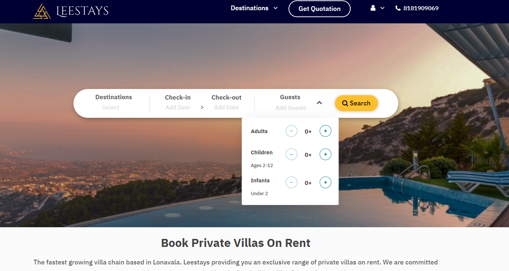

# Leestays - Villa/Resort Booking Web Application

## Now it's more easy to book your holidays..!!

Live website link here : [Live link](https://leestays.com/)

## Features

-   `Manage ALl the Orders`
-   `Add new Listings`
-   `Manage All the Listings`
-   `Make Admin`

## Website Desktop View Screenshot

### What is Leestays ?

-   Users can Find the best villas and resorts in our website.
-   Filtering option by area and date-time.
-   For better user experience we have `Google Geo Location API` to pin point address in google map
-   Easy payment system with Debit/Credit cards and Mobile Banking.

# `For NDA Agreement I have deleted some codes and removed some logics from the repo. Just the structure and my coding pattern are there for the recruiters to get an idea about my Code Structure and Pattern. So, it will not help you if you want to download the codes. `

## Developer Info

Let's Connect here [LinkedIn](https://www.linkedin.com/in/kazinafizanam)
Check Portfolio here [Portfolio](https://nafizanam.com/)
Check Projects here [Github](https://github.com/Nafiz-Anam)
Hire me here [Fiverr](https://www.fiverr.com/anam_nafiz)
Download Resume here [Resume](https://drive.google.com/file/d/1T3aiJem8izl5RWVxr_U1LGnyaDKdkbCN/view?usp=sharing)
